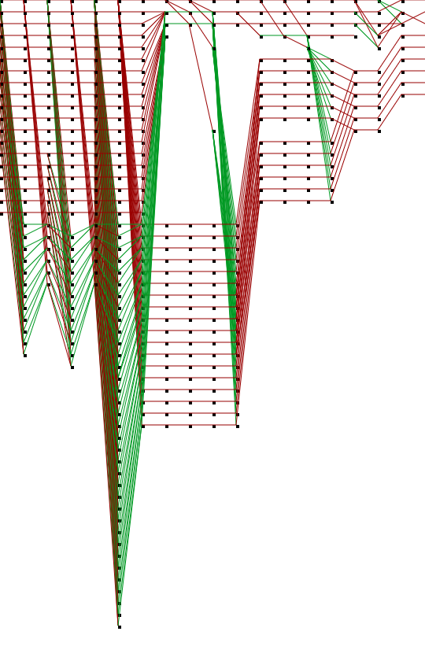

# Neural Network Nim game using backprop. !!!not working well!!!

Cody Smith. 2019

## Usage:
Most of the code is in [main.js](./main.js) or [Network.js](./Network.js) . Also, [index.html](./index.html) has some user interface code.
### From the web
This is written in javascript and can be run from the web page https://m0ose.github.io/cs362_backprop/index.html .
### Locally
Download/unzip the [files](https://github.com/m0ose/cs361backprop/archive/master.zip) to a directory and then open index.html. You may be able to just double click the index.html file. Otherwise, in chrome go to file->open->[directory]/index.html . Note: I have only tested this in the Chrome browser.

## How it works

Currently this just tries to train a network to play nim. It outputs a graph of the error and that is about it. 

Need to figure out why the backprop is not working. 

